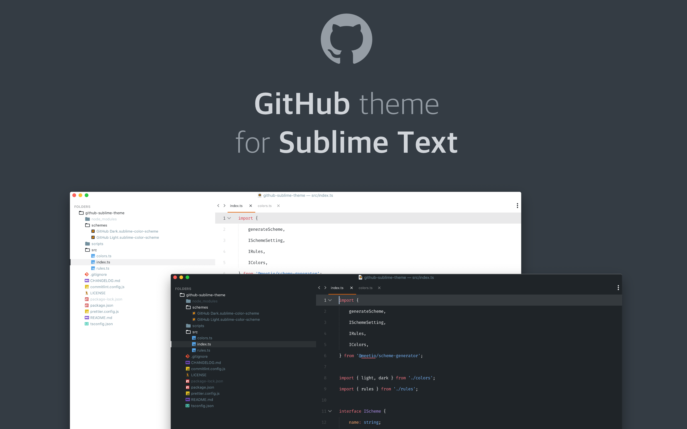

# GitHub's Sublime Text themes

**Project inspired on [GitHub VS Code theme](https://github.com/primer/github-vscode-theme).**



<p align="center">
    <a href="https://github.com/mauroreisvieira/github-sublime-theme/releases" title="GitHub tag">
        
    </a>
    <a href="" title="Sublime Version">
        
    </a>
    <a href="https://packagecontrol.io/packages/GitHub%20Theme" title="Package Control">
        
    </a>
</p>

## Install

**Package Control:**

1. Open `Command Palette` using menu item `Tools → Command Palette` or `CMD/CTRL` + `SHIFT` +`P`.
2. Choose `Package Control: Install Package`.
3. Type `GitHub Theme` and press `ENTER`.

**Manually:**

1. Download the latest release and unzip.
2. Go to `Sublime Text → Preferences → Browse Packages`.
3. Move folder inside and rename the folder to `GitHub Theme`.

## Activate the Theme

**You can activate available themes from:**

1. Command Palette `Tools → Command Palette` or `CMD/CTRL` + `SHIFT` + `P`
2. Typing `UI: Select Theme` next find for your favorite theme:
    - `GitHub Adaptive` 🆕
    - `GitHub Dark`
    - `GitHub Dimmed`
    - `GitHub Light`
3. Finally press `ENTER`:

**You can activate available schemes from:**

1. Command Palette `Tools → Command Palette` or `CMD/CTRL` + `SHIFT` + `P`
2. Typing `UI: Select Color Scheme` choose you favorite scheme:
    - `GitHub Dark`
    - `GitHub Dimmed`
    - `GitHub Light`
3. Finally press `ENTER`:

**Additionally, there are also two older schemes.**

-   `GitHub Light Legacy`
-   `GitHub Dark Legacy`

> **Note:** They might not get updated frequently and are kept for legacy reasons.

## Recommended Settings

To enjoy a better experience using this theme in Sublime Text, please check the following settings.

```json
{
    "font_face": "Fira Code",
    "highlight_line": true,
    "margin": 20,
    "line_padding_bottom": 7,
    "line_padding_top": 7,
    "caret_extra_bottom": 12,
    "caret_extra_top": 12,
    "hide_tab_scrolling_buttons": true
}
```
